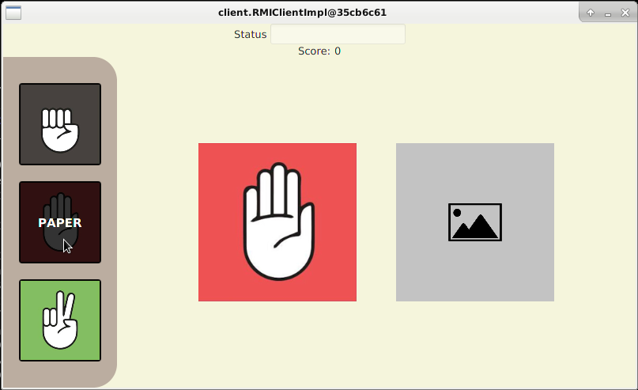
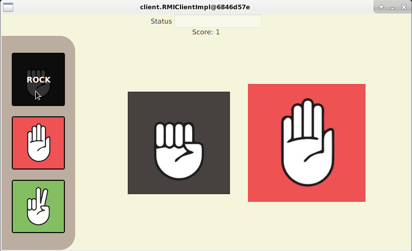

# Shifumi

## Description

L’application est un jeu vidéo adapté du "shifumi". Elle a était développé durant la première année de mon 
**Master Développement Web & Data Science** dans le cadre d'un module universitaire intitulé **"Système distribué"** 
encadré par [Gregory Bourguin](http://web.gregory-bourguin.fr/) maitre de conférence à L'Université du Littoral Côte d'Opale.

L'objectif du projet était de développer une application utilisant l'API RMI du langage Java basé sur TCP/IP.

### Dérouler

- Lorsque deux clients sont lancé on peut jouer au pierre-feuille-ciseaux.
- Le joueur choisit une des actions possible sur le côté en cliquant sur une des icônes.
- Le joueur peut (pour l'instant) modifier son choix tant que l'adversaire n'a pas jouer.
- Lorsque les deux joueurs ont choisie leur action, celle-ci sont révélé sur le displayer.
- L'action gagnante fait un zoom avant et le score du vainqueur est incrémenter de 1.
- Le displayer se réinitialise est les joueurs peuvent choisir une nouvelle action.
- En cas d'égalité, les deux actions zooment en avant mais le score reste inchangé.

### Images





### Fonctionnalitées

#### Fait

* Développer l'engine du jeu
* Développer les interactions clients/serveurs
* Développer l'interface graphique du client
    * Composer d'un "HUD" permettant de voir le statut de la partie en cours ainsi que le score du joueur
    * Composer d'une liste d'action disposer sur le côté, chaque action est définie par une icône
    * Composer d'un "Displayer" qui affiche les actions jouées

#### En cours

#### À faire / Souhaitées

* Depuis le serveur, gérer plusieurs partie en cours
* Mettre à jour le statut du joueur au cours de la partie afin de le prévenir de l'action à faire
* Mettre en place un écran d'attente lorsqu'un joueur quitte la partie afin d'avertir l'adversaire
* Donner la possibilité au joueur d'avoir plusieurs sets d'icône pour les actions et de les choisir au début de la partie.
* Débloquer des icônes supérieurs à l'aide de "succès"
* Développer une barre de statistique pour chaque joueur visible à l'écran (nom, nombre de victoire, plus grosse série de victoire)

## Utilisation

### Dépendances

Version de Java >= 8.0 (Afin d'avoir JavaFX inclus dans la JVM)

| Environnement Technique | |
| ---: | :--- |
| **Langage** | Java |
| **Technologies/Logiciels** | JavaFX |
| **Normes & architectures** | Remote Method Invocation (RMI) |

### Installation

```
git clone "nom du depot"
```

### Lancement (run)
Après la compilation, exécuter la classe *RMIServerImpl* qui sert de serveur puis exécuter la classe *ShifumiClientApplication*
qui sert de client. Pour lancer une partie il faut exécuter deux clients en parallèles.

#### Help

Lorsqu'on lance les deux clients il arrive qu'ils aient le même hashcode 
qui leur sert d'identifiant, cela pose problème au niveaux du serveur qui ne sait pas les reconnaître. Il faut 
donc relancer un des deux clients jusqu'a ce qu'il ait un hashcode différent de l'autre. Le hashcode du client
se situe en haut de la fenêtre. 
